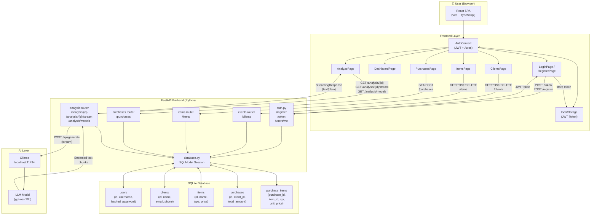
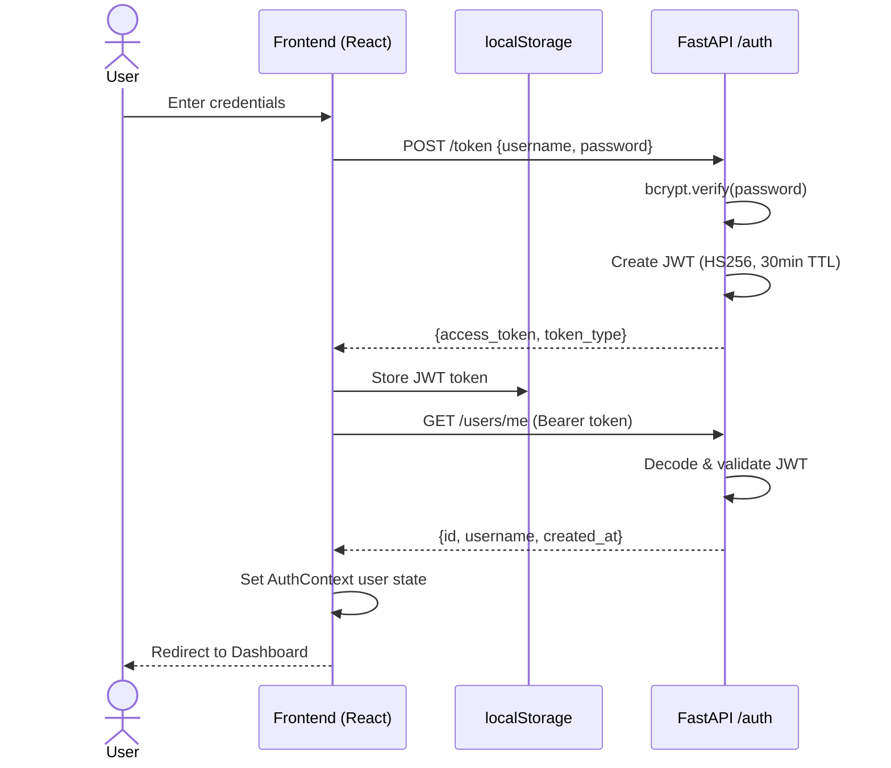
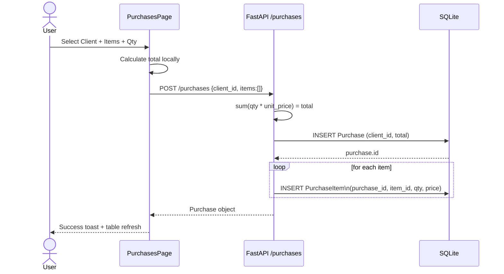
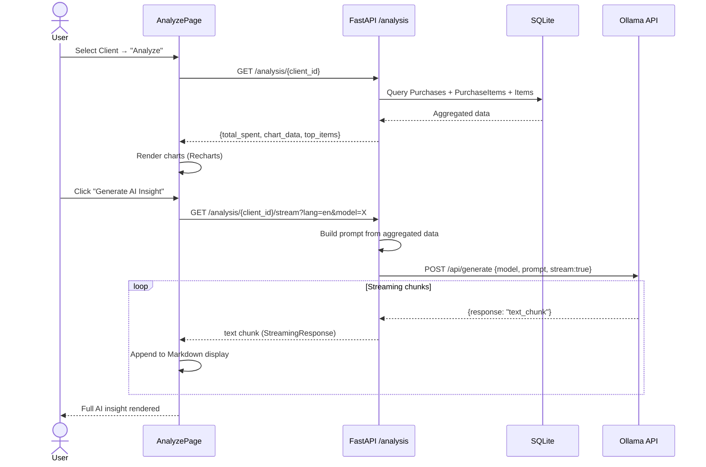
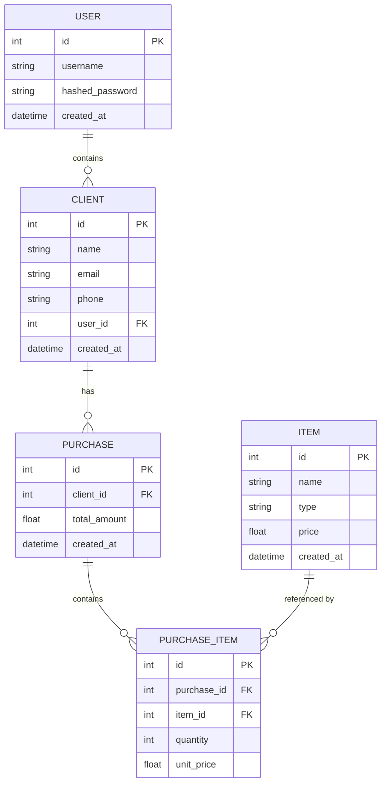
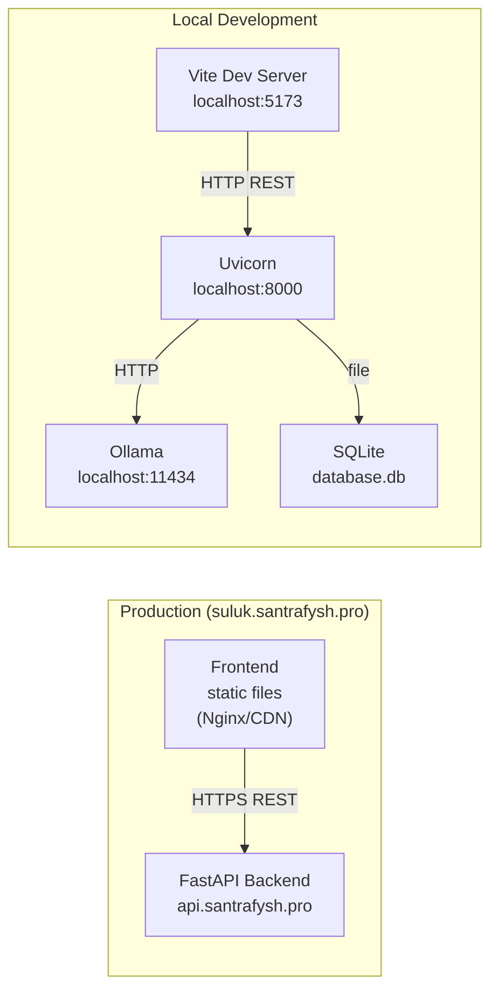

# SulukPlatform — Data Flow Diagram

## System Overview

SulukPlatform is a business intelligence web app with three major tiers: a **React/TypeScript Frontend**, a **FastAPI AI Backend**, and a local **Ollama LLM** service.

---

## Authentication Flow

---

## Purchase Creation Flow

---

## AI Analysis Flow

---

## Data Models & Relationships

---

## Deployment Topology

