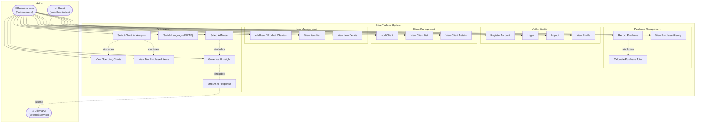
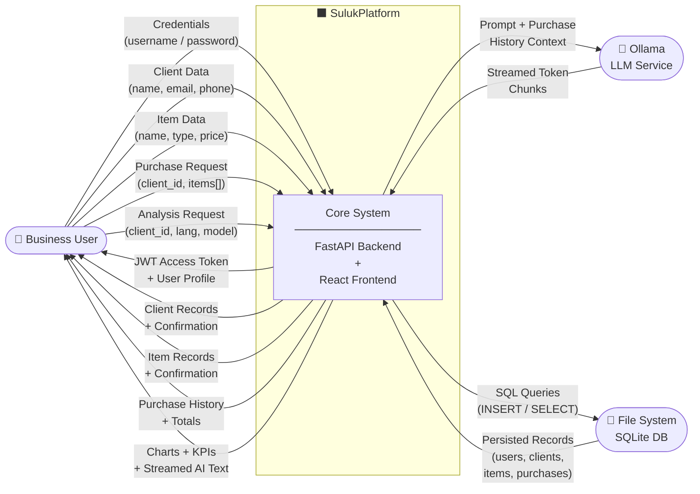
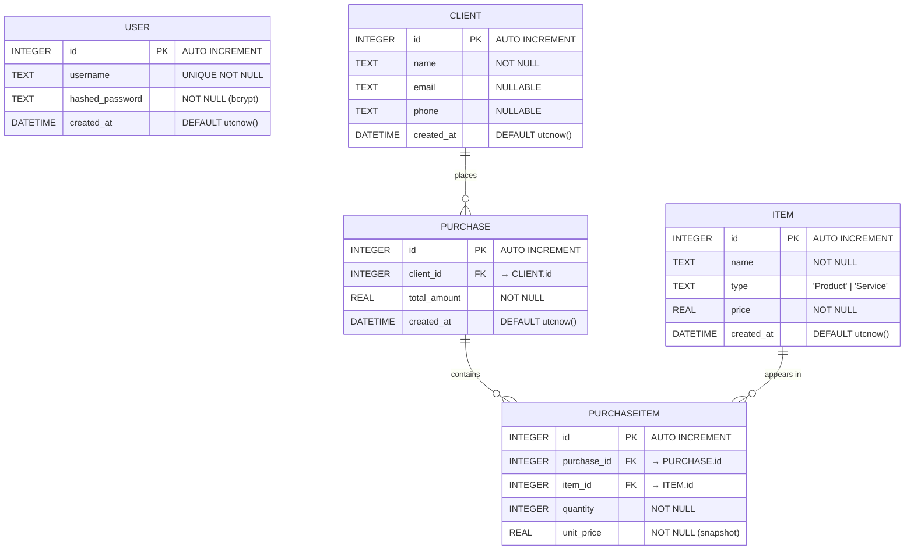

# SulukPlatform — System Diagrams

---

## 1. Use Case Diagram



---

## 2. Context Diagram (Level 0 DFD)



---

## 3. Entity Relationship Diagram (ERD)



> **Note:** `USER` is decoupled — authentication is global (all users share the same data store). `unit_price` in `PURCHASEITEM` is a price snapshot at time of purchase, independent of `ITEM.price`.

---

## 4. Database Schema

```sql
-- ============================================================
-- SULUK PLATFORM DATABASE SCHEMA
-- Engine : SQLite  |  ORM : SQLModel (SQLAlchemy core)
-- ============================================================

-- ------------------------------------------------------------
-- TABLE: user
-- Stores authenticated platform operator accounts.
-- Passwords are hashed with bcrypt (work factor default).
-- ------------------------------------------------------------
CREATE TABLE IF NOT EXISTS "user" (
    id               INTEGER      PRIMARY KEY AUTOINCREMENT,
    username         TEXT         NOT NULL UNIQUE,
    hashed_password  TEXT         NOT NULL,
    created_at       DATETIME     NOT NULL DEFAULT (DATETIME('now'))
);

CREATE INDEX IF NOT EXISTS ix_user_username ON "user" (username);


-- ------------------------------------------------------------
-- TABLE: client
-- Represents a business's customer.
-- One client can have many purchases (1:N).
-- ------------------------------------------------------------
CREATE TABLE IF NOT EXISTS client (
    id          INTEGER   PRIMARY KEY AUTOINCREMENT,
    name        TEXT      NOT NULL,
    email       TEXT,
    phone       TEXT,
    created_at  DATETIME  NOT NULL DEFAULT (DATETIME('now'))
);


-- ------------------------------------------------------------
-- TABLE: item
-- A product or service offered by the business.
-- type: 'Product' | 'Service'
-- price: current list price (NOT the transactional price).
-- ------------------------------------------------------------
CREATE TABLE IF NOT EXISTS item (
    id          INTEGER   PRIMARY KEY AUTOINCREMENT,
    name        TEXT      NOT NULL,
    type        TEXT      NOT NULL,     -- 'Product' | 'Service'
    price       REAL      NOT NULL,
    created_at  DATETIME  NOT NULL DEFAULT (DATETIME('now'))
);


-- ------------------------------------------------------------
-- TABLE: purchase
-- A sales transaction header linked to one client.
-- total_amount is pre-calculated as SUM(qty * unit_price).
-- ------------------------------------------------------------
CREATE TABLE IF NOT EXISTS purchase (
    id            INTEGER   PRIMARY KEY AUTOINCREMENT,
    client_id     INTEGER   NOT NULL REFERENCES client(id),
    total_amount  REAL      NOT NULL,
    created_at    DATETIME  NOT NULL DEFAULT (DATETIME('now'))
);


-- ------------------------------------------------------------
-- TABLE: purchaseitem
-- Line items belonging to a purchase (N:M bridge table).
-- unit_price is snapshotted at transaction time, so it is
-- independent of item.price which may change later.
-- ------------------------------------------------------------
CREATE TABLE IF NOT EXISTS purchaseitem (
    id           INTEGER   PRIMARY KEY AUTOINCREMENT,
    purchase_id  INTEGER   NOT NULL REFERENCES purchase(id),
    item_id      INTEGER   NOT NULL REFERENCES item(id),
    quantity     INTEGER   NOT NULL,
    unit_price   REAL      NOT NULL    -- price at time of sale
);
```

### Column Summary Table

| Table | Column | Type | Constraint | Notes |
|---|---|---|---|---|
| `user` | `id` | INTEGER | PK, AUTO | — |
| `user` | `username` | TEXT | UNIQUE, NOT NULL | Indexed |
| `user` | `hashed_password` | TEXT | NOT NULL | bcrypt hash |
| `user` | `created_at` | DATETIME | NOT NULL | UTC default |
| `client` | `id` | INTEGER | PK, AUTO | — |
| `client` | `name` | TEXT | NOT NULL | — |
| `client` | `email` | TEXT | NULLABLE | — |
| `client` | `phone` | TEXT | NULLABLE | — |
| `client` | `created_at` | DATETIME | NOT NULL | UTC default |
| `item` | `id` | INTEGER | PK, AUTO | — |
| `item` | `name` | TEXT | NOT NULL | — |
| `item` | `type` | TEXT | NOT NULL | `'Product'` or `'Service'` |
| `item` | `price` | REAL | NOT NULL | Current list price |
| `item` | `created_at` | DATETIME | NOT NULL | UTC default |
| `purchase` | `id` | INTEGER | PK, AUTO | — |
| `purchase` | `client_id` | INTEGER | FK → `client.id` | — |
| `purchase` | `total_amount` | REAL | NOT NULL | Pre-calculated |
| `purchase` | `created_at` | DATETIME | NOT NULL | UTC default |
| `purchaseitem` | `id` | INTEGER | PK, AUTO | — |
| `purchaseitem` | `purchase_id` | INTEGER | FK → `purchase.id` | — |
| `purchaseitem` | `item_id` | INTEGER | FK → `item.id` | — |
| `purchaseitem` | `quantity` | INTEGER | NOT NULL | — |
| `purchaseitem` | `unit_price` | REAL | NOT NULL | Price snapshot |

### Relationship Summary

| Relationship | Cardinality | Description |
|---|---|---|
| `client` → `purchase` | **1 : N** | One client places many purchases |
| `purchase` → `purchaseitem` | **1 : N** | One purchase contains many line items |
| `item` → `purchaseitem` | **1 : N** | One item appears in many line items |
| `purchase` ↔ `item` | **N : M** | Resolved via `purchaseitem` bridge table |
